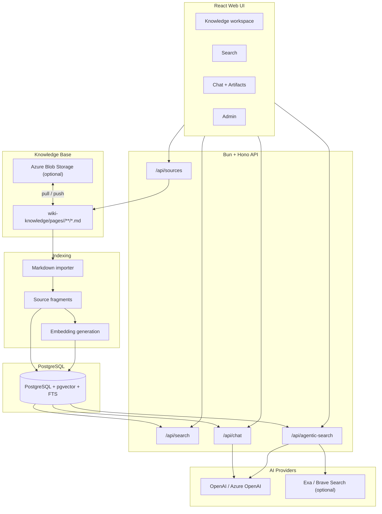

# regular-rag

[](https://bun.sh/)
[](https://hono.dev/)
[](https://react.dev/)
[](https://www.postgresql.org/)
[](https://www.typescriptlang.org/)
[](LICENSE.md)

`regular-rag` は、Markdown で管理する社内知識ベースを取り込み、全文検索・ベクトル検索・LLM 応答へつなぐ RAG システムです。

主役は Hono のスターター構成ではなく、次の一連の流れです。

1. `wiki-knowledge/pages/<category>/**/*.md` に知識を置く
2. PostgreSQL + pgvector に本文断片、全文検索インデックス、embedding を作る
3. Web UI / API / Agentic Search から根拠つきで検索・回答する
4. 必要に応じて Wiki 本文を編集し、再インデックスして検索面へ反映する

Hono、React、Vite、Bun はこの RAG 体験を動かすための実装基盤です。

## 目次

1. [このシステムでできること](#このシステムでできること)
2. [RAG アーキテクチャ](#rag-アーキテクチャ)
3. [導入パス](#導入パス)
4. [セットアップ](#セットアップ)
5. [起動と確認](#起動と確認)
6. [知識ベースの管理](#知識ベースの管理)
7. [環境変数](#環境変数)
8. [主要コマンド](#主要コマンド)
9. [API](#api)
10. [開発とデプロイ](#開発とデプロイ)

## このシステムでできること

### Markdown 知識ベースの取り込み

`wiki-knowledge/pages/` 以下の Markdown をカテゴリつきの Wiki ページとして読み込みます。本文は検索しやすい断片に分割され、PostgreSQL に保存されます。

### ハイブリッド検索

RAG の検索面は、全文検索とベクトル検索を併用します。

| 検索 | 役割 |
| :--- | :--- |
| 全文検索 | 固有名詞、用語、設定値、コード断片などの一致に強い検索 |
| ベクトル検索 | 言い換えや概念的に近い内容を拾う検索 |
| RRF マージ | 全文検索とベクトル検索の結果を統合して回答用の根拠を選ぶ |

### チャット RAG

`/api/chat` と Web UI の Chat 画面から、検索された Wiki 断片を根拠として LLM に回答させます。会話履歴、検索ログ、生成された artifact も DB に保存されます。

### Agentic Search

OpenAI / Azure OpenAI の Responses API を使い、LLM が必要に応じてツールを呼び出す検索モードです。

| ツール | 役割 |
| :--- | :--- |
| `search_evidence` | 同じクエリで全文検索、ベクトル検索、Web 検索をまとめて実行 |
| `wiki_read` | 検索断片だけでは足りないときに Wiki 本文を読み直す |
| `fetch` | Web 検索結果の URL を取得し、本文テキストを確認する |

Web 検索は任意です。`EXA_API_KEY` または `BRAVE_SEARCH_API_KEY` がある場合だけ外部検索を併用します。

### Wiki 編集と同期

Web UI から Markdown ページの作成、編集、削除、フォルダ管理、履歴確認ができます。保存先はローカル `wiki-knowledge/` が基本で、Azure Blob Storage との pull / push 同期にも対応しています。

## RAG アーキテクチャ



### 主要モジュール

| 領域 | パス | 内容 |
| :--- | :--- | :--- |
| RAG 検索 | `src/modules/rag/` | 全文検索、ベクトル検索、RRF マージ、検索根拠の整形 |
| 知識ベース | `src/modules/sources/` | Markdown 取り込み、Wiki slug、ローカル / Blob 同期 |
| Agentic Search | `src/modules/agentic-search/` | Responses API ループ、ツール実行、引用生成 |
| Chat | `src/modules/chat/` | 会話履歴、RAG コンテキスト、artifact 抽出 |
| API | `src/routes/` | `/api/sources`, `/api/search`, `/api/chat`, `/api/agentic-search` など |
| Web UI | `web/src/` | Knowledge / Search / Chat / Admin の画面 |
| DB | `src/db/`, `drizzle/` | Drizzle schema と migration |

## 導入パス

### 1. 既存 snapshot からすぐ確認する

ローカルで動作確認したい場合の最短ルートです。`seed/dev-db.sql.gz` に保存済みの開発用 DB snapshot を復元します。

```bash
bun install
cp .env.example .env
docker compose up -d db
bun run db:seed
bun run dev
```

Web UI は `http://localhost:5173` です。初期ユーザー情報は snapshot / seed の内容に依存します。

### 2. 空の DB から自分の Markdown を取り込む

自分の知識ベースを入れて RAG を作るルートです。

```bash
bun install
cp .env.example .env
docker compose up -d db
bun run db:migrate
bun run auth:create-admin -- --email admin@example.com --name "Admin User"
```

`wiki-knowledge/pages/<category>/**/*.md` に Markdown を置いたあと、検索インデックスを作ります。

```bash
bun run wiki:index:all
bun run dev
```

### 3. Agentic Search まで確認する

`.env` に OpenAI または Azure OpenAI の設定を入れます。

```dotenv
OPENAI_API_KEY=...
# または
AZURE_OPENAI_ENDPOINT=https://example.openai.azure.com
AZURE_OPENAI_API_KEY=...
AZURE_OPENAI_DEPLOYMENT=gpt-5-4-mini
AZURE_OPENAI_EMBEDDINGS_DEPLOYMENT=text-embedding-3-small
```

疎通は次で確認できます。

```bash
bun run agentic:smoke
```

## セットアップ

### 前提

| ツール | 用途 |
| :--- | :--- |
| Bun | ランタイム、パッケージ管理、CLI 実行 |
| Docker | ローカル PostgreSQL / pgvector |
| OpenAI または Azure OpenAI | Chat、embedding、Agentic Search |
| Exa または Brave Search | 任意の Web 検索 |

### 依存関係

```bash
bun install
```

### 環境変数

```bash
cp .env.example .env
```

最低限、ローカル UI と DB だけを確認するなら `.env.example` のまま起動できます。embedding や LLM 応答を使う場合は OpenAI / Azure OpenAI のキーを設定してください。

### DB 起動

```bash
docker compose up -d db
```

DB の疎通だけ確認する場合は次を使います。

```bash
docker exec regular-rag-db pg_isready -U postgres -d regular_rag
```

### DB 作成

空の DB から始める場合:

```bash
bun run db:migrate
```

保存済み snapshot を復元する場合:

```bash
bun run db:seed
```

snapshot を更新する場合:

```bash
bun run db:dump
```

## 起動と確認

### 開発サーバー

```bash
bun run dev
```

| 画面 / API | URL |
| :--- | :--- |
| Web UI | `http://localhost:5173` |
| Health | `http://localhost:5173/api/health` |
| API | `http://localhost:5173/api/*` |

### RAG インデックス作成

```bash
# Markdown 取り込み + embedding 作成
bun run wiki:index:all

# Markdown 取り込み / FTS のみ
bun run wiki:index:fts

# embedding の未作成分だけ処理
bun run wiki:index:embed
```

embedding API の rate limit に当たる場合は、直接 CLI にオプションを渡して間隔を空けます。

```bash
bun run src/cli/wiki-index.ts --phase=embed --sleep-ms=1000 --batch-size=25
```

### 基本動作の確認

1. `Knowledge` 画面でページ一覧が表示される
2. `Search` 画面でキーワード検索とベクトル検索の結果が返る
3. `Chat` 画面で Wiki 由来の根拠を使った回答が返る
4. Agentic Search を使う場合は `bun run agentic:smoke` が通る

### snapshot の簡易検査

`seed/dev-db.sql.gz` を復元元として使う前に gzip として壊れていないか確認できます。

```bash
gzip -t seed/dev-db.sql.gz
```

## 知識ベースの管理

### Markdown 配置

知識ベースは `wiki-knowledge/pages/` の下に、カテゴリディレクトリを切って配置します。

```text
wiki-knowledge/
└── pages/
    ├── tech/
    │   ├── hono.md
    │   └── react.md
    └── finance/
        └── report.md
```

`pages/` 直下に Markdown を置くのではなく、必ず `pages/<category>/...` に置いてください。例として `pages/tech/hono.md` は slug `tech/hono`、カテゴリ `tech` として扱われます。

### Web UI からの編集

`Knowledge` 画面では、ページ作成、本文編集、フォルダ作成、履歴、diff、再インデックスを扱えます。編集結果は `wiki-knowledge/` の Git repository に反映されます。

### Azure Blob Storage

`WIKI_STORAGE_BACKEND=azure-blob` にすると、Blob の内容をローカル `wiki-knowledge/` に同期してから既存の Wiki / RAG 処理へ渡します。

```dotenv
WIKI_STORAGE_BACKEND=azure-blob
AZURE_STORAGE_CONNECTION_STRING=...
WIKI_BLOB_CONTAINER=wiki-knowledge
WIKI_BLOB_PREFIX=poc/wiki
```

手動同期:

```bash
bun run wiki:blob:pull
bun run wiki:blob:push
```

Blob 側のパスもローカルと同じです。prefix なしなら `pages/tech/hono.md`、`WIKI_BLOB_PREFIX=poc/wiki` なら `poc/wiki/pages/tech/hono.md` に置きます。

## 環境変数

| 変数 | 必須 | 説明 |
| :--- | :---: | :--- |
| `JWT_SECRET` | production では必須 | JWT 署名キー。32 文字以上 |
| `APP_URL` | 任意 | 公開 URL。cookie と CORS の既定値に使う |
| `CORS_ORIGINS` | 任意 | 許可 origin。カンマ区切り |
| `AUTH_COOKIE_SECURE` | 任意 | HTTPS cookie の有効化 |
| `AUTH_COOKIE_SAME_SITE` | 任意 | `lax` / `strict` / `none` |
| `SECURITY_HEADERS_MODE` | 任意 | `auto` / `http` / `https` |
| `WIKI_STORAGE_BACKEND` | 任意 | `local` / `azure-blob` |
| `AZURE_STORAGE_CONNECTION_STRING` | Blob 利用時 | Azure Blob Storage 接続文字列 |
| `WIKI_BLOB_CONTAINER` | Blob 利用時 | Wiki を置く Blob container |
| `WIKI_BLOB_PREFIX` | 任意 | Blob container 内の prefix |
| `OPENAI_API_KEY` | LLM 利用時 | OpenAI API キー |
| `OPENAI_BASE_URL` | 任意 | OpenAI 互換 endpoint |
| `AZURE_OPENAI_ENDPOINT` | Azure 利用時 | Azure OpenAI endpoint |
| `AZURE_OPENAI_API_KEY` | Azure 利用時 | Azure OpenAI API キー |
| `AZURE_OPENAI_DEPLOYMENT` | Azure 利用時 | Chat / Agentic Search 用 deployment |
| `AZURE_OPENAI_EMBEDDINGS_DEPLOYMENT` | embedding 利用時 | embedding 用 deployment |
| `EXA_API_KEY` | 任意 | Exa Search |
| `BRAVE_SEARCH_API_KEY` | 任意 | Brave Search |

非シークレットの既定値は `src/config/appDefaults.ts` に集約されています。

## 主要コマンド

```bash
# 開発サーバー
bun run dev

# 本番ビルド後のサーバー起動
bun run start

# DB
bun run db:migrate
bun run db:dump
bun run db:seed
bun run db:seed:users

# 管理者作成
bun run auth:create-admin -- --email <email> --name "<name>"

# Wiki / RAG インデックス
bun run wiki:index:all
bun run wiki:index:fts
bun run wiki:index:embed
bun run wiki:register:missing-slugs
bun run wiki:blob:pull
bun run wiki:blob:push

# Agentic Search
bun run agentic:smoke

# 品質チェック
bun run typecheck
bun run lint
bun run format:check
bun run test
bun run build
bun run verify
```

## API

主要 API はすべて `/api` 配下です。

| 領域 | Method / Path | 内容 |
| :--- | :--- | :--- |
| Health | `GET /api/health` | API 疎通確認 |
| Auth | `POST /api/auth/login` | ログイン |
| Auth | `POST /api/auth/refresh` | refresh token 更新 |
| Auth | `POST /api/auth/logout` | ログアウト |
| Auth | `GET /api/auth/me` | ログイン中ユーザー |
| Sources | `GET /api/sources/tree` | Wiki ツリー |
| Sources | `GET /api/sources/categories` | カテゴリ一覧 |
| Sources | `GET /api/sources/pages/:slug` | Wiki ページ取得 |
| Sources | `POST /api/sources/pages` | Wiki ページ作成 |
| Sources | `PUT /api/sources/pages/:slug` | Wiki ページ更新 |
| Sources | `DELETE /api/sources/pages/:slug` | Wiki ページ削除 |
| Sources | `POST /api/sources/reindex` | Markdown を再取り込み |
| Search | `POST /api/search` | ハイブリッド検索 |
| Agentic | `POST /api/agentic-search` | Agentic Search |
| Chat | `POST /api/chat` | RAG チャット |
| Chat | `GET /api/chat/conversations` | 会話一覧 |
| Chat | `GET /api/chat/conversations/:id/messages` | 会話メッセージ |
| Settings | `GET /api/settings/system-context` | ユーザー別 system context |
| Settings | `PUT /api/settings/system-context` | system context 更新 |
| Admin | `GET /api/admin/users` | ユーザー一覧 |
| Admin | `POST /api/admin/users` | ユーザー作成 |

## 開発とデプロイ

### 品質ゲート

通常の変更確認は次を使います。

```bash
bun run verify
```

CI workflow の lint も含める場合:

```bash
bun run verify:ci
```

`verify` は型チェック、Biome lint、format check、Vitest、server / web build を順に実行します。

### 本番ビルド

```bash
bun run build
NODE_ENV=production bun run start
```

### Azure VM

Nginx + Let's Encrypt + Bun server + React static + PostgreSQL / pgvector を 1 VM に置く手順は [docs/azure-vm-deploy.md](docs/azure-vm-deploy.md) を参照してください。

HTTP smoke deploy:

```bash
scripts/deploy/deploy-azure-vm-http.sh
```

### 本番設定の注意

- `JWT_SECRET` は必ずランダムな強い値に変更してください
- HTTPS では `APP_URL=https://...`, `AUTH_COOKIE_SECURE=true`, `SECURITY_HEADERS_MODE=https` を使います
- HTTP 検証では `APP_URL=http://...`, `AUTH_COOKIE_SECURE=false`, `SECURITY_HEADERS_MODE=http` を使います
- Blob 同期を使う場合は、専用 container または専用 prefix を使ってください

## ライセンス

[MIT License](LICENSE.md)
