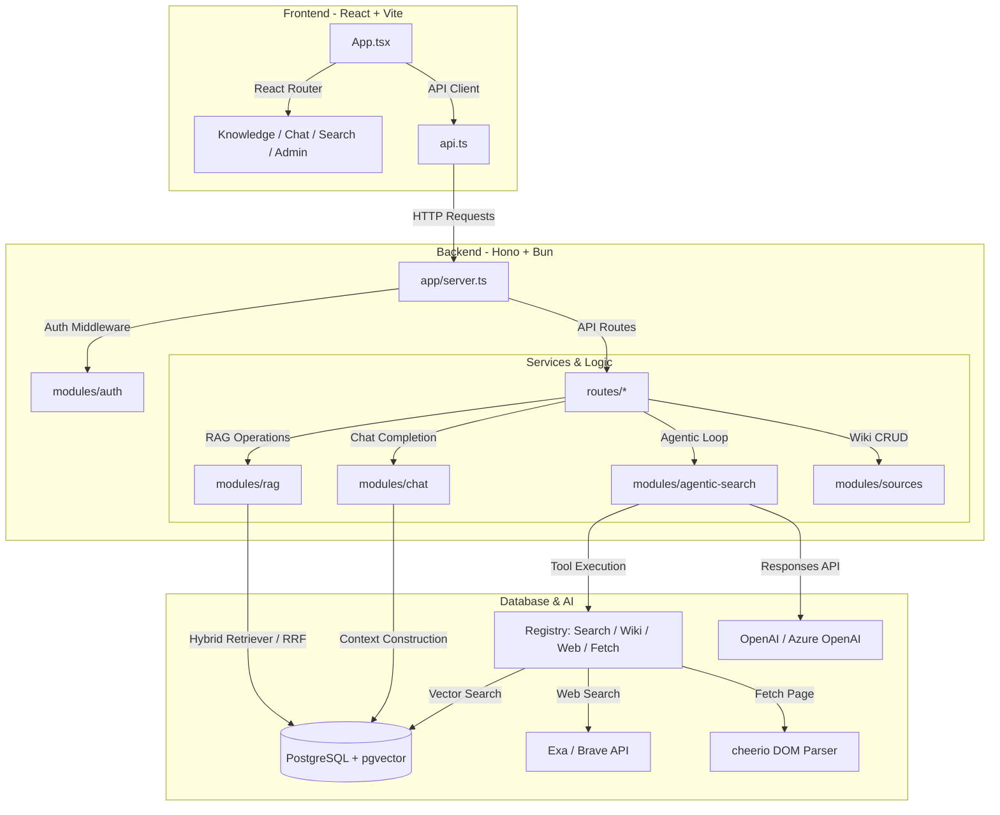

# 🚀 regular-rag

[](https://bun.sh/)
[](https://hono.dev/)
[](https://react.dev/)
[](https://www.postgresql.org/)
[](https://www.typescriptlang.org/)
[](LICENSE.md)

**Hono (Backend) + React & Vite (Frontend)** で構築された、ローカル Markdown 知識ベース専用の **エンタープライズグレード RAG (Retrieval-Augmented Generation) プラットフォーム**です。

pgvector + PostgreSQL 全文検索によるハイブリッド検索、OpenAI / Azure OpenAI の **Responses API を用いた自律エージェント検索 (Agentic Search)**、Claude 風の **Artifact 自動抽出エンジン**、そして **堅牢なロールベースユーザー管理 (RBAC)** を完備しています。

---

## 📋 目次

1. [主な機能](#-主な機能-key-features)
2. [システムアーキテクチャ](#-システムアーキテクチャ-architecture)
3. [ディレクトリ構造](#-ディレクトリ構造)
4. [前提条件](#-前提条件-prerequisites)
5. [セットアップ & インストール](#-セットアップ--インストール-installation)
6. [クイックスタート](#-クイックスタート-quick-start)
7. [環境変数リファレンス](#-環境変数リファレンス)
8. [CLI コマンドリファレンス](#-cli-コマンドリファレンス)
9. [API エンドポイント](#-api-エンドポイント)
10. [知識ベースの構成ルール](#-知識ベースの構成ルール)
11. [開発ガイド](#-開発ガイド)
12. [本番デプロイ](#-本番デプロイ)
13. [貢献方法](#-貢献方法-contributing)
14. [ライセンス](#-ライセンス)

---

## 🌟 主な機能 (Key Features)

### 1. 🔍 ハイブリッド・セマンティック検索 (RRF Hybrid Search)

ベクトル検索と全文検索を組み合わせた高精度な知識検索エンジンです。

| 検索方式 | 技術 | 説明 |
| :--- | :--- | :--- |
| セマンティック検索 | `pgvector` | 多次元ベクトル近傍探索（HNSW インデックス） |
| 全文検索 | `pg_trgm` + FTS | 日本語対応トークナイズド探索 |
| スコア融合 | RRF | Reciprocal Rank Fusion で両スコアを最適重み付け融合 |

### 2. 🤖 自律エージェント検索 (Agentic Search)

OpenAI / Azure OpenAI の `Responses API` を用いた、LLM が能動的に情報収集・検証を行う高度な検索モードです。エージェントは以下のツールを状況に応じて自律的に呼び出します。

| ツール | 説明 |
| :--- | :--- |
| `full_text_search` | ナレッジベース全文インデックスの検索 |
| `vector_search` | ベクトル近傍探索 |
| `wiki_read` | 元の Wiki ドキュメント本文を丸ごと動的に読み直して文脈を検証 |
| `web_search` | **Exa Search** / **Brave Search** を用いたリアルタイム Web 検索 |
| `fetch` | Web ページの HTML を `cheerio` でパース・クリーニングしてコンテキスト挿入 |

### 3. 💎 Claude 風 Artifacts エンジン

生成 AI の出力に含まれるコードやデータ構造をリアルタイムで検知し、専用パネルに自動抽出・バージョン管理します。

**サポート形式**: `markdown` / `table` / `mermaid` / `chart` / `json` / `code` / `diagram-dsl`

### 4. 🔒 ロールベースユーザー管理 (RBAC & Auth)

セルフサインアップを意図的に排除した、クローズドな知識共有向けの堅牢な認証システムです。

| 機能 | 実装 |
| :--- | :--- |
| パスワードハッシュ | `scrypt` |
| セッション管理 | `jose` による JWT Access / Refresh Token（httpOnly Cookie） |
| Refresh Token | SHA-256 ハッシュ化 DB 保存 + ワンタイムローテーション |
| 通信セキュリティ | CORS 制御 / CSRF 保護 / Secure Headers / レート制限 |
| 管理者機能 | ユーザー追加・無効化・パスワードリセット（Admin パネル内蔵） |

### 5. 📝 Markdown 知識ベース管理

- **WYSIWYG エディタ**: Web UI からドキュメントを直接編集・保存
- **自動インデックス化**: Markdown ファイルの FTS インデックス生成と Embedding ベクトルの一括計算
- **カテゴリ管理**: ディレクトリ構造をそのままカテゴリとして認識

### 6. 🧠 ユーザー設定・システムコンテキスト

- LLM の動作をコントロールするシステムプロンプトをユーザー単位で永続化
- チャット履歴の保存・取得・削除

---

## 🏗️ システムアーキテクチャ (Architecture)



### 技術スタック

| レイヤー | 技術 |
| :--- | :--- |
| ランタイム | Bun |
| バックエンド | Hono v4 |
| フロントエンド | React 19 + Vite 8 |
| DB / ORM | PostgreSQL 17 + pgvector + Drizzle ORM |
| 認証 | jose (JWT) + scrypt |
| スタイル | Tailwind CSS v4 + Vanilla CSS |
| ルーティング (FE) | TanStack Router |
| データフェッチ (FE) | TanStack Query |
| Linter / Formatter | Biome |
| テスト | Vitest |

---

## 📁 ディレクトリ構造

```text
regular-rag/
├── src/                        # バックエンドソースコード
│   ├── app/                    # Hono アプリのブートストラップ・サーバー設定
│   ├── cli/                    # CLI ツール群（管理者作成・DB マイグレーション等）
│   ├── config/                 # 設定・定数管理
│   ├── core/                   # コア共通ロジック
│   ├── db/                     # Drizzle スキーマ・マイグレーション・DB 接続
│   ├── middleware/              # JWT 認証・管理者検証ミドルウェア
│   ├── modules/
│   │   ├── agentic-search/     # エージェントループ・MCP 互換ツールレジストリ
│   │   ├── artifacts/          # <artifact> XML 抽出・解析エンジン
│   │   ├── auth/               # 認証ロジック・パスワードハッシュ (scrypt)
│   │   ├── chat/               # チャットサービス・RAG メッセージ管理
│   │   ├── rag/                # ハイブリッドリトリーバー (RRF マージ)
│   │   ├── settings/           # ユーザー設定・システムコンテキストの永続化
│   │   └── sources/            # Wiki 記事解析・Slug 生成・インポータ
│   ├── providers/              # LLM プロバイダ (OpenAI / Azure OpenAI) アダプター
│   ├── repositories/           # DB アクセス層
│   ├── routes/                 # API ルート定義
│   ├── services/               # ドメインサービス
│   ├── types/                  # 共通型定義
│   └── utils/                  # ユーティリティ関数
│
├── web/                        # フロントエンドソースコード
│   └── src/
│       ├── domains/
│       │   ├── auth/           # ログイン・認証状態管理
│       │   ├── chat/           # チャット UI・Artifact パネル
│       │   ├── knowledge/      # 知識ベース閲覧コンポーネント
│       │   └── search/         # 検索結果表示コンポーネント
│       ├── admin-user-management.tsx  # 管理者ユーザー管理パネル
│       ├── knowledge-workspace.tsx    # Wiki 閲覧・編集ワークスペース
│       ├── api.ts              # バックエンド API クライアント
│       ├── App.tsx             # アプリケーションルート・認証ラッパー
│       └── styles.css          # グローバルスタイル (Tailwind CSS v4)
│
├── docs/                       # 設計ドキュメント・実装計画
├── drizzle/                    # DB マイグレーションファイル
├── wiki-knowledge/             # Markdown 知識ベース格納ディレクトリ
├── Dockerfile                  # pgvector 付き PostgreSQL イメージ
├── docker-compose.yml          # ローカル DB 環境
├── biome.json                  # Biome (Linter/Formatter) 設定
├── drizzle.config.ts           # Drizzle ORM 設定
├── tsup.config.ts              # サーバービルド設定
├── vite.config.ts              # フロントエンド + Dev Server 設定
└── vitest.config.ts            # テスト設定
```

---

## 🛠️ 前提条件 (Prerequisites)

| ツール | バージョン | 備考 |
| :--- | :--- | :--- |
| [Bun](https://bun.sh/) | >= 1.0 | ランタイム・パッケージマネージャ |
| [Docker](https://www.docker.com/) | 任意 | ローカル PostgreSQL 環境用 |
| PostgreSQL | >= 17 | `vector` / `pg_trgm` 拡張が必要 |
| OpenAI or Azure OpenAI | — | Chat / Embedding / Agentic Search 用 API キー |
| Exa or Brave Search | — | Web 検索機能用（任意） |

---

## 📦 セットアップ & インストール (Installation)

### 1. 依存関係のインストール

```bash
bun install
```

### 2. 環境変数の設定

```bash
cp .env.example .env
```

`.env` を開き、必要なパラメータを設定してください（詳細は[環境変数リファレンス](#-環境変数リファレンス)を参照）。

### 3. PostgreSQL の起動 (Docker)

pgvector 拡張入りの PostgreSQL をローカルで起動します。

```bash
docker compose up -d db
```

> **Note**: Docker を使わず既存の PostgreSQL を利用する場合は、`vector` と `pg_trgm` 拡張を手動で有効化してください。

### 4. データベース・マイグレーション

Drizzle ORM でテーブルを作成し、拡張機能を有効化します。

```bash
bun run db:migrate
```

### 5. 初期管理者アカウントの作成

セルフサインアップが無効化されているため、初回のみ CLI から管理ユーザーを作成します。

```bash
bun run auth:create-admin -- --email admin@example.com --name "Admin User"
```

> 実行時に対話形式でパスワードの入力が求められます。

初期ユーザーをまとめて投入する場合は、`seed/users.json` を使います。seed データはパスワードを直接持たず、環境変数から読み取ります。

```bash
SEED_ADMIN_PASSWORD='<admin-password>' \
SEED_MEMBER_PASSWORD='<member-password>' \
bun run db:seed:users
```

検証環境で一時パスワードを生成したい場合は、次のように実行できます。生成されたパスワードは実行結果の JSON にだけ表示されます。

```bash
bun run db:seed:users -- --generate-missing-passwords
```

---

## 🚀 クイックスタート (Quick Start)

### 開発用サーバーの起動

フロントエンド (Vite) とバックエンド (Hono) を統合した開発サーバーを起動します。

```bash
bun run dev
```

| エンドポイント | URL |
| :--- | :--- |
| Web UI | http://localhost:5173 |
| API | http://localhost:5173/api/* |

### 知識ベース (Markdown) のインデックス化

`wiki-knowledge/pages/<category>/**/*.md` を読み込み、FTS インデックスの生成と Embedding ベクトルの計算を一括実行します。

```bash
# FTS + Embedding を一括実行（推奨）
bun run wiki:index:all

# FTS インデックスのみ
bun run wiki:index:fts

# Embedding のみ（FTS 済みドキュメントに対してバックフィル）
bun run wiki:index:embed
```

### Agentic Search の疎通テスト

LLM 接続・Embedding 生成・エージェント自律応答フローをまとめて検証するスモークテストです。

```bash
bun run agentic:smoke
```

---

## 🔧 環境変数リファレンス

非シークレットのアプリ設定は `src/config/appDefaults.ts` に集約しています。`.env` は API キー、JWT シークレット、LLM の endpoint/model だけを置く想定です。

| 変数名 | 必須 | 説明 | デフォルト / 例 |
| :--- | :---: | :--- | :--- |
| **認証** | | | |
| `JWT_SECRET` | ✅ | JWT 署名シークレット | ランダムな 32 文字以上の文字列 |
| **HTTP / HTTPS 切り替え** | | | |
| `APP_URL` | | 公開 URL。HTTP/HTTPS の cookie 既定値と CORS origin に使う | `https://products.dev.gxp.jp` |
| `CORS_ORIGINS` | | 追加で許可する origin。カンマ区切り | `http://products.dev.gxp.jp,http://localhost:5173` |
| `AUTH_COOKIE_SECURE` | | 認証 cookie に `Secure` を付けるか。HTTP 検証では `false`、HTTPS では `true` | `true` / `false` |
| `AUTH_COOKIE_SAME_SITE` | | 認証 cookie の SameSite | `lax` |
| `SECURITY_HEADERS_MODE` | | HSTS / COOP など HTTPS 前提ヘッダのモード | `auto` / `http` / `https` |
| **Wiki storage** | | | |
| `WIKI_STORAGE_BACKEND` | | `wiki-knowledge` の保存先。`azure-blob` にすると Blob をローカルへ同期して既存の Wiki 処理に流す | `local` / `azure-blob` |
| `AZURE_STORAGE_CONNECTION_STRING` | | Azure Blob Storage 接続文字列。`azure-blob` 時のみ必要 | |
| `WIKI_BLOB_CONTAINER` | | Wiki ファイルを置く Blob コンテナ | `wiki-knowledge` |
| `WIKI_BLOB_PREFIX` | | コンテナ内の任意 prefix。未設定ならコンテナ直下 | `poc/wiki` |
| **Azure OpenAI** | | | |
| `AZURE_OPENAI_ENDPOINT` | | Azure OpenAI エンドポイント URL | `https://xxx.openai.azure.com` |
| `AZURE_OPENAI_API_KEY` | | Azure OpenAI API キー | |
| `AZURE_OPENAI_DEPLOYMENT` | | Chat / Agentic Search 用デプロイ名 | `gpt-5-4-mini` |
| `AZURE_OPENAI_EMBEDDINGS_DEPLOYMENT` | | Embedding 用デプロイ名 | `text-embedding-3-small` |
| **OpenAI 直接利用** | | | |
| `OPENAI_API_KEY` | | OpenAI API キー（Azure 未設定時に使用） | |
| `OPENAI_BASE_URL` | | OpenAI 互換 API のカスタムベース URL | 未設定時は `https://api.openai.com/v1` |
| **Web 検索** | | | |
| `EXA_API_KEY` | | Exa Search API キー | |
| `BRAVE_SEARCH_API_KEY` | | Brave Search API キー | |

---

## 🖥️ CLI コマンドリファレンス

```bash
# 開発サーバー起動（フロントエンド + バックエンド統合）
bun run dev

# バックエンドのみ起動（本番モード）
bun run start

# 管理者アカウント作成
bun run auth:create-admin -- --email <email> --name "<name>"

# 初期ユーザー seed
bun run db:seed:users

# 知識ベースインデックス化
bun run wiki:index:all         # FTS + Embedding 全フェーズ
bun run wiki:index:fts         # FTS インデックスのみ
bun run wiki:index:embed       # Embedding のみ（バックフィル）
bun run wiki:blob:pull         # Azure Blob -> wiki-knowledge 同期
bun run wiki:blob:push         # wiki-knowledge -> Azure Blob 同期

# Markdown インポート
bun run import:markdown

# 欠損 Slug の登録
bun run wiki:register:missing-slugs

# Agentic Search スモークテスト
bun run agentic:smoke

# DB マイグレーション
bun run db:migrate             # Drizzle ベースのカスタムマイグレーション
bun run db:generate            # マイグレーションファイルの生成
bun run db:migrate:drizzle     # drizzle-kit による直接マイグレーション

# 品質チェック（型チェック + Lint + Format + Test + Build）
bun run verify
bun run verify:ci             # verify + GitHub Actions workflow lint

# 個別チェック
bun run actionlint            # .github/workflows の検査
bun run typecheck              # TypeScript 型チェック
bun run lint                   # Biome Linter
bun run format                 # Biome フォーマッタ（自動修正）
bun run format:check           # フォーマットチェック（修正なし）
bun run test                   # Vitest テスト実行
bun run test:watch             # Vitest ウォッチモード
bun run test:coverage          # カバレッジレポート生成

# ビルド
bun run build                  # サーバー + フロントエンドをまとめてビルド
bun run build:server           # tsup でサーバーのみビルド
bun run build:web              # Vite でフロントエンドのみビルド
```

---

## 📋 API エンドポイント

### 🔐 認証 (Authentication)

| Method | Path | 説明 |
| :--- | :--- | :--- |
| `POST` | `/api/auth/login` | ログイン（httpOnly Cookie にトークンをセット） |
| `POST` | `/api/auth/refresh` | リフレッシュトークンのローテーション |
| `POST` | `/api/auth/logout` | ログアウト（Cookie クリア） |
| `GET` | `/api/auth/me` | 現在のログインユーザー情報取得 |

### 👥 管理者機能 (Admin — 要 Admin 権限)

| Method | Path | 説明 |
| :--- | :--- | :--- |
| `GET` | `/api/admin/users` | 登録ユーザー一覧取得 |
| `POST` | `/api/admin/users` | 新規ユーザーの招待・作成 |
| `PATCH` | `/api/admin/users/:userId` | ユーザー名・ロール更新 |
| `POST` | `/api/admin/users/:userId/disable` | アカウントの有効化・無効化 |
| `POST` | `/api/admin/users/:userId/reset-password` | パスワードの強制リセット |

### 💬 チャット & 検索 (Chat & RAG Search)

| Method | Path | 説明 |
| :--- | :--- | :--- |
| `POST` | `/api/chat` | RAG を活用した対話（履歴保存） |
| `GET` | `/api/chat/conversations` | チャットセッション履歴取得 |
| `DELETE` | `/api/chat/conversations/:conversationId` | 会話セッション削除 |
| `POST` | `/api/search` | ハイブリッド検索（全文 vs ベクトルの比較結果） |
| `POST` | `/api/agentic-search` | 自律エージェント型検索の実行 |

### 📚 Wiki / 知識ベース

| Method | Path | 説明 |
| :--- | :--- | :--- |
| `GET` | `/api/wiki` | ドキュメント一覧取得 |
| `GET` | `/api/wiki/:slug` | ドキュメント詳細取得 |
| `POST` | `/api/wiki` | ドキュメント新規作成 |
| `PUT` | `/api/wiki/:slug` | ドキュメント更新 |
| `DELETE` | `/api/wiki/:slug` | ドキュメント削除 |

### ⚙️ 設定 (Settings)

| Method | Path | 説明 |
| :--- | :--- | :--- |
| `GET` | `/api/settings` | ユーザー設定取得 |
| `PUT` | `/api/settings` | ユーザー設定保存 |

---

## 📖 知識ベースの構成ルール

知識ベースは `wiki-knowledge/pages/` 以下に Markdown ファイルを配置します。

```text
wiki-knowledge/
└── pages/
    ├── tech/
    │   ├── hono.md          → slug: tech/hono       / カテゴリ: tech
    │   └── react.md         → slug: tech/react      / カテゴリ: tech
    └── finance/
        └── report.md        → slug: finance/report  / カテゴリ: finance
```

> **重要**: `pages/` 直下に Markdown ファイルを直接配置することはできません。必ずカテゴリディレクトリ（第1階層のフォルダ）の下に配置してください。

### Azure Blob Storage を使う場合

`WIKI_STORAGE_BACKEND=azure-blob` にすると、起動時・Wiki API 読み込み時・インデックス化前に Blob の内容を `wiki-knowledge/` へ同期します。以降はローカルファイルと同じ `pages/<category>/**/*.md` として扱われます。

Blob へ置くパスもローカルと同じです。prefix を使わない場合は `pages/tech/hono.md`、`WIKI_BLOB_PREFIX=poc/wiki` の場合は `poc/wiki/pages/tech/hono.md` に配置してください。

専用コンテナ、または専用 prefix を使ってください。アプリ側で Wiki を編集した場合はローカル `wiki-knowledge` の内容が Blob に push され、prefix 配下にあるローカル未存在ファイルは削除対象になります。

```bash
WIKI_STORAGE_BACKEND=azure-blob \
AZURE_STORAGE_CONNECTION_STRING='<connection-string>' \
bun run wiki:blob:pull

bun run wiki:index:all
```

---

## 🧑‍💻 開発ガイド

### 品質ゲート (Quality Gates)

PR や本番リリース前に以下を必ず実行してください。

```bash
bun run verify
```

CI では GitHub Actions workflow の検査も含めて次を実行します。

```bash
bun run verify:ci
```

`actionlint` はローカルにインストールされている必要があります。macOS では `brew install actionlint` で導入できます。

`verify` は以下を順番に実行します。

1. **型チェック** (`tsc --noEmit`)
2. **静的解析** (`biome lint`)
3. **フォーマットチェック** (`biome format`)
4. **テストスイート** (`vitest run`)
5. **プロダクションビルド** (`tsup` & `vite build`)

### Drizzle ORM によるスキーマ変更

```bash
# スキーマ変更後にマイグレーションファイルを生成
bun run db:generate

# マイグレーションを実行
bun run db:migrate
```

### 新規 API エンドポイントの追加

1. `src/routes/` に新しいルートファイルを追加
2. `src/app/server.ts` でルートを登録
3. `web/src/api.ts` にクライアント関数を追加

---

## 🐳 本番デプロイ

### Azure VM への手動デプロイ

Nginx + Let's Encrypt + Hono/Bun + React static + PostgreSQL/pgvector を 1 VM に構成します。詳細は [docs/azure-vm-deploy.md](docs/azure-vm-deploy.md) を参照してください。

Let's Encrypt を実行する前に、ローカルから HTTP-only の smoke deploy を確認できます。

```bash
scripts/deploy/deploy-azure-vm-http.sh
```

### Docker を使用したデプロイ

#### 1. DB のみ Docker で起動

```bash
docker compose up -d db
```

#### 2. 本番ビルド

```bash
bun run build
```

#### 3. サーバー起動

```bash
NODE_ENV=production bun run start
```

### 本番環境での注意事項

- `JWT_SECRET` は必ずランダムな強力な文字列に変更してください
- HTTP 検証では `APP_URL=http://...`, `AUTH_COOKIE_SECURE=false`, `SECURITY_HEADERS_MODE=http` を使います
- HTTPS 本番では `APP_URL=https://...`, `AUTH_COOKIE_SECURE=true`, `SECURITY_HEADERS_MODE=https` を使います
- ポート、DB 接続先、Web 検索プロバイダなどの共通設定は `src/config/appDefaults.ts` で管理します

---

## 🤝 貢献方法 (Contributing)

1. リポジトリをフォークします
2. 機能ブランチを作成します (`git checkout -b feature/amazing-feature`)
3. 変更をコミットします (`git commit -m 'Add amazing feature'`)
4. `bun run verify` ですべての品質チェックが通ることを確認します
5. プルリクエストを作成してください

---

## 📄 ライセンス

本プロジェクトは [MIT License](LICENSE.md) のもとで公開されています。
